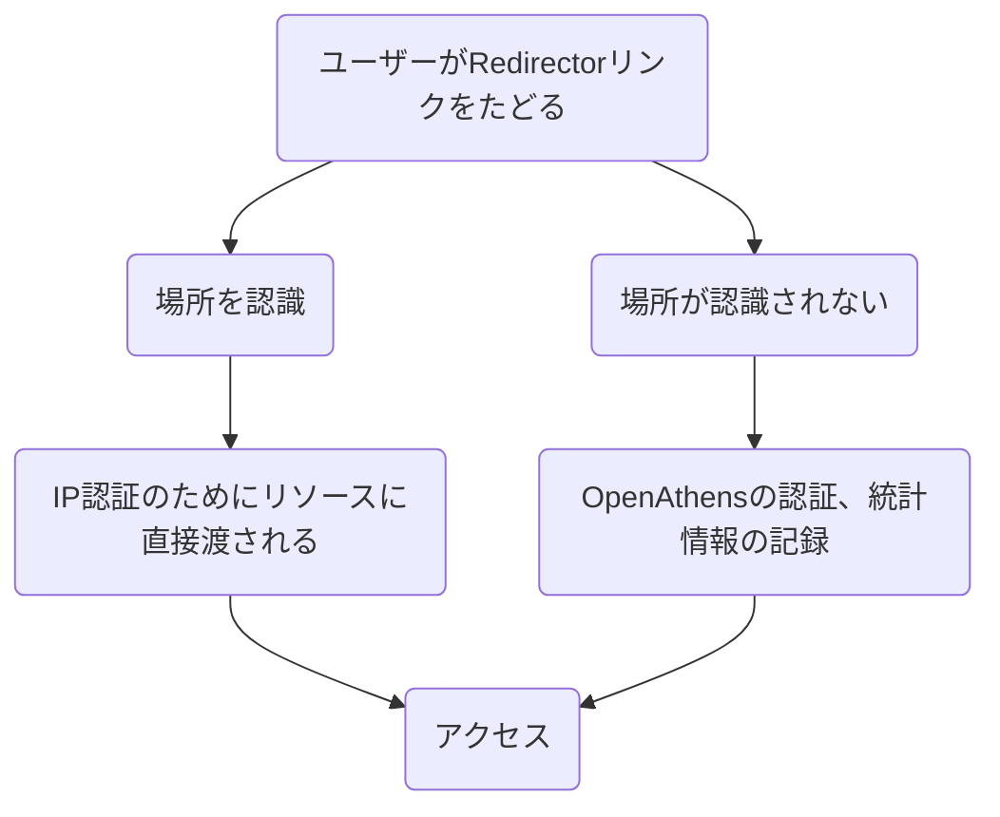

| ソース | 翻訳元 URL | 翻訳日 |
| ---- | ---- | ---- |
| OpenAthens Docs | [Redirector IP bypass zones](https://docs.openathens.net/libraries/Redirector-IP-bypass-zones.11076430.html) | 2022-05-23 |

# Redirector IP バイパスゾーン

Redirectorリンクを使用する場合、オプションでRedirector IPバイパスゾーンを追加すると、リソースがIP認証によるアクセスを許可する場所では、OpenAthens認証をバイパスすることができます。これは、図書館OPAC、ポータル、リンクリゾルバ上で、ネットワークの内か外かに応じてリソースへのリンクを別々に維持する必要がある場合に非常に便利です。Redirectorバイパスゾーンは、アクセスURL（バイパス可能）またはリダイレクト設定（リダイレクト可能）のいずれかを持つすべてのリソースで機能します。

ユーザーがRedirectorのリンクをたどると、Redirectorは、ユーザーをそのままサービスプロバイダに渡すか、ユーザーがまだサインインしていなければ、ユーザー名とパスワードを要求されるOpenAthens認証ポイントに渡すかを決定します。
ユーザージャーニーの概要は、次のようなものです。
 



## IPレンジの設定

Menu: Preferences > Redirector


リソースのIP認証の対象となるIPアドレスまたは範囲を入力し、プリファレンスを保存します。例えば：

```
123.3.23.12
123.3.23.*
123.3.22-23.*
```
範囲は最後の2オクテット内に指定することもできます。スラッシュで範囲を指定した場合、その範囲を適切な形式に変換する必要があります。


ほとんどの場合、これらの範囲はドメインレベルで指定すれば十分ですが、ローカルな状況（たとえば、ローカルな組織が追加のIP範囲を持っている場合、特にそれがローカルなリソースの購読に関連している場合）に対応するために、組織ごとに追加の範囲を追加することができます。 ただし、ローカル管理者が、間違えた際の影響を認識していることを確認する必要があります（以下を参照）。

ドメインレベルでは、このバイパスゾーンを無視し、常にOpenAthensアクセスルートを使用するリソースを指定するオプションもあります。これを設定するには、[リソースの追加] ボタンをクリックし、リソース名の入力を開始します。リソースを選択し、保存します。IP バイパスと互換性のあるリソースのみがリストアップされます。

### 何か気をつけることはありますか？
RedirectorのIPアドレスでカバーされる場所は、リソースのIP認証に依存します。指定する範囲と、リソースがIP認証する範囲を一致させるように注意する必要があります。

* アドレスの範囲を大きく指定しすぎた場合（つまり、リソースによってIP認証されないアドレスが含まれる場合）、ユーザーはアクセスできない場所にいることになる可能性があります。
* アドレスの範囲を小さく指定した場合 (つまり、リソースで IP 認証されるすべてのアドレスをカバーしない場合)、ユーザーが予期しないときに OpenAthens 認証情報を求められることがあります。
バイパスゾーンやリソース例外の変更はすぐには適用されず、変更が有効になるまで最大で14時間かかることがあります。

OpenAthensの認証ポイントを経由しないアクセスの場合、統計情報を記録することができません。